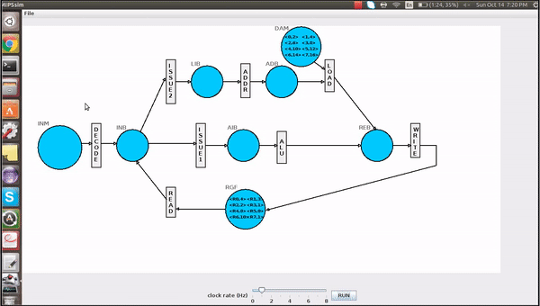

Name : Akash R Vasishta 
UFID : 53955080
Date : 02/26/2018

## __PetriNet SIMULATOR for MIPS Processor__

I. Files Included
-----------------

MIPSsim.java	 - Implements Petrinet simulator for a MIPS processor.
Makefile 	 - Consists of all necessary commands to run the "Combiner" program in one step
instructions.txt - This file has the input instructions.
registers.txt    - This file has the input registers.
datamemory.txt   - This file has the input data memory locations.

II. How to run the simulator
---------------------------

Command Line Arguments and outputs

Step1 : javac MIPSsim.java
Step2 : java MIPSsim

II. Description
---------------

Read project1.pdf for the problem description
